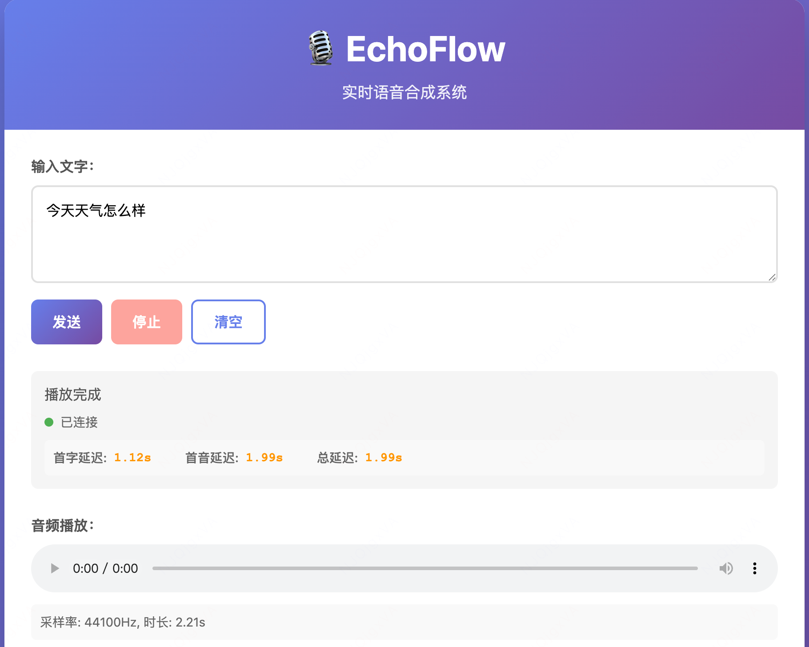

# EchoFlow - 实时语音合成系统


一个基于流式 LLM 和 CosyVoice 的实时语音合成系统，支持边生成边播放，音质接近真人。

## 预览



## 功能特性

- 🚀 **流式 LLM 处理**：支持 GPT、DeepSeek、Qwen 等模型
- 🎙️ **高质量语音合成**：基于 CosyVoice（阿里通义），音质 9.5/10
- 📡 **WebSocket 通信**：实时音频流传输，超低延迟
- 🎵 **边播边听**：音频流边生成边播放，无需等待
- 💻 **跨平台支持**：支持 Windows、macOS、Linux
- 🎯 **GPU 加速**：支持 NVIDIA CUDA 和 Apple Silicon MPS

## 系统架构

```
用户输入文字
    ↓
流式 LLM（GPT/DeepSeek/Qwen）
    ↓ 按 token 逐步输出文本
CosyVoice TTS（阿里通义）
    ↓ 每生成一小段就推送音频块
WebSocket 实时传输
    ↓
前端接收音频流边播边听
```

## 快速开始

### Windows 用户（一键启动）

双击运行 `run_windows.bat` 即可！

脚本会自动：
- ✅ 检查 Python 和 Git 环境
- ✅ 创建虚拟环境
- ✅ 安装所有依赖
- ✅ 下载 CosyVoice 模型（11GB）
- ✅ 启动服务

### macOS / Linux 用户

#### 1. 安装依赖

```bash
# 安装 Python 依赖
pip install -r requirements.txt

# 克隆 CosyVoice
git clone --recursive https://github.com/FunAudioLLM/CosyVoice.git

# 安装 Git LFS（用于下载模型）
# macOS
brew install git-lfs

# Ubuntu/Debian
sudo apt-get install git-lfs

# 下载模型文件
cd CosyVoice
git lfs install
git lfs pull
pip install -r requirements.txt
cd ..
```

#### 2. 配置环境变量

创建 `.env` 文件：

```env
# TTS 引擎
TTS_ENGINE=cosyvoice

# CosyVoice 配置
COSYVOICE_MODEL_DIR=CosyVoice/pretrained_models/CosyVoice-300M-SFT
COSYVOICE_USE_GPU=true
COSYVOICE_SAMPLE_RATE=22050
COSYVOICE_SPEAKER=中文女

# LLM 配置
OPENAI_API_KEY=your_api_key_here
LLM_MODEL=gpt-3.5-turbo
```

#### 3. 启动服务

```bash
python backend/server.py
```

## 配置说明

### TTS 引擎选择

支持以下 TTS 引擎：

| 引擎 | 音质 | 延迟 | 部署 | 推荐 |
|------|------|------|------|------|
| **CosyVoice** | ⭐⭐⭐⭐⭐ 9.5/10 | 150-250ms | 本地 11GB | ✅ 推荐 |
| Edge-TTS | ⭐⭐⭐⭐ 8/10 | 300-500ms | 云端 | 备选 |
| Piper | ⭐⭐⭐ 7/10 | 100-150ms | 本地 50MB | 快速 |

### 环境变量配置

在 `.env` 文件中配置：

```env
# TTS 引擎选择
TTS_ENGINE=cosyvoice  # 可选: cosyvoice, edge, piper

# CosyVoice 配置（阿里巴巴通义实验室）
COSYVOICE_MODEL_DIR=CosyVoice/pretrained_models/CosyVoice-300M-SFT
COSYVOICE_USE_GPU=true  # 启用 GPU 加速（推荐）
COSYVOICE_SAMPLE_RATE=22050
COSYVOICE_SPEAKER=中文女  # 可选: 中文女, 中文男

# LLM 配置
OPENAI_API_KEY=your_api_key_here
OPENAI_BASE_URL=https://api.openai.com/v1
LLM_MODEL=gpt-3.5-turbo
LLM_TEMPERATURE=0.8
LLM_MAX_TOKENS=4000
```

## 访问服务

启动后，在浏览器中访问：

```
http://localhost:8000
```

后端和前端已集成在一起，无需单独启动前端服务。

## 使用说明

1. 在输入框中输入要转换为语音的文字
2. 点击"发送"按钮
3. 系统会：
   - 通过流式 LLM 逐步生成文本
   - 每生成一小段文本就立即转换为语音
   - 通过 WebSocket 实时推送音频流
   - 前端边接收边播放

## API 接口

### WebSocket 接口

`ws://localhost:8000/ws/chat`

**客户端发送：**
```json
{
  "type": "text",
  "text": "用户输入的文本"
}
```

**服务器返回：**
- 音频数据（二进制 Blob）
- 结束标记：`{"type": "end"}`

### HTTP 接口

`POST /api/chat`

**请求：**
```json
{
  "text": "用户输入的文本"
}
```

**响应：**
- 音频流（audio/mpeg）

## 项目结构

```
EchoFlow/
├── backend/
│   ├── server.py          # FastAPI 主服务器
│   ├── llm_stream.py      # 流式 LLM 接口
│   ├── realtime_tts.py    # CosyVoice TTS 实现
│   └── config.py          # 配置管理
├── frontend/
│   ├── index.html         # 前端页面
│   ├── style.css          # 样式
│   └── app.js             # WebSocket 客户端
├── CosyVoice/             # CosyVoice 模型和代码（11GB）
├── run_windows.bat        # Windows 一键启动脚本
├── requirements.txt       # Python 依赖
└── README.md             # 文档
```

## 性能指标

### CosyVoice（当前）

- **音质**: 9.5/10 ⭐⭐⭐⭐⭐
- **首字延迟**: 150-250ms
- **合成速度**: 实时 5-10x（GPU）
- **模型大小**: 11GB
- **内存占用**: ~4GB
- **GPU 显存**: ~4GB（可选）
- **稳定性**: 优秀

### 系统要求

- **CPU**: 4 核心以上
- **内存**: 8GB+（推荐 16GB）
- **磁盘**: 15GB+（CosyVoice 模型）
- **GPU**: 可选（NVIDIA CUDA / Apple MPS）
- **网络**: 需要访问 LLM API

## GPU 加速

### NVIDIA GPU（Linux/Windows）

```bash
# 安装 CUDA 版本的 PyTorch
pip install torch torchvision torchaudio --index-url https://download.pytorch.org/whl/cu118

# 在 .env 中启用 GPU
COSYVOICE_USE_GPU=true
```

### Apple Silicon（macOS）

```bash
# PyTorch 自动支持 MPS
# 在 .env 中启用 GPU
COSYVOICE_USE_GPU=true
```

## 故障排查

### 问题 1：CosyVoice 未初始化

**解决方案**：
1. 确认模型文件已下载完整（11GB）
2. 检查 Python 路径设置
3. 查看 `server.log` 日志

### 问题 2：音频输出不完整

**解决方案**：
1. 查看实时日志：`tail -f server.log`
2. 检查是否有 TTS 合成错误
3. 确认 WebSocket 连接稳定

### 问题 3：GPU 加速不生效

**解决方案**：
```bash
# 测试 GPU 是否可用
python -c "import torch; print(f'CUDA: {torch.cuda.is_available()}'); print(f'MPS: {torch.backends.mps.is_available()}')"
```

## 扩展

### 切换 TTS 引擎

修改 `.env` 文件：

```env
# 使用 Edge-TTS（云端，免费）
TTS_ENGINE=edge

# 使用 Piper（本地，快速）
TTS_ENGINE=piper
```

### 更换 LLM 模型

```env
# 使用 GPT-4
LLM_MODEL=gpt-4

# 使用 DeepSeek
OPENAI_BASE_URL=https://api.deepseek.com/v1
LLM_MODEL=deepseek-chat
```

## 许可证

MIT License

## GitHub Star 趋势


